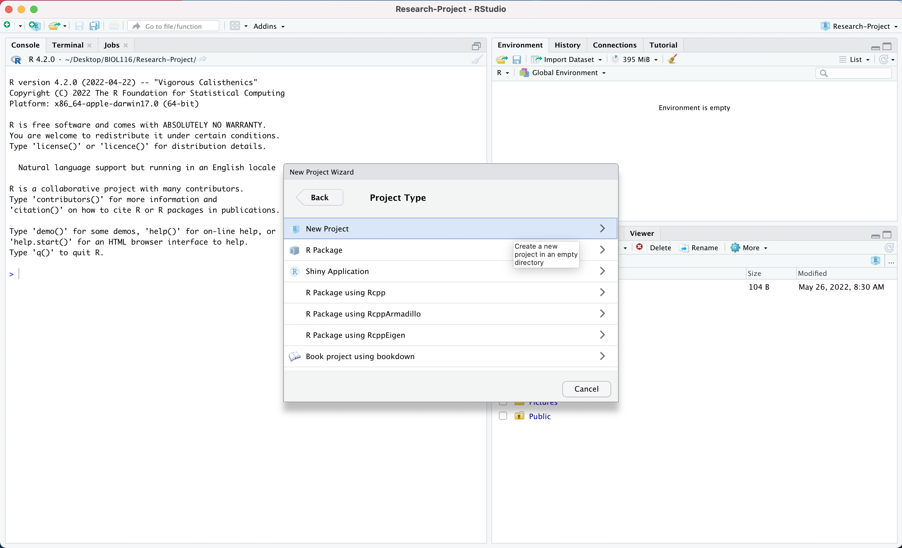

# Directories

*Last updated `r Sys.Date()`*

Directories are just folders; we'll use the terms interchangeably. All of the files on your computer are organized around folders. In some respects, this means that your computer is synonymous with a filing cabinet; you open it up and there are a bunch of folders holding files and sub-folders. Following this analogy, if you were to open your computer--and you were on a Mac--you'd see 16 folders, including the following:

```
Applications/
Users/
home/
Library/
Volumes/
System/
bin/
usr/
```

There's a very good chance you've never seen any of these folders. We call this the root of your file system; these folders don't sit inside of any other folders, they only hold other folders and files.

The folder called `Users` holds all of the files that you create on your computer. In fact, there is a folder in there named after the user name that you use to log into your computer with. And within that a series of folders that you should be fairly familiar with including a `Downloads/` and `Documents/` folder. It also includes a `Desktop/` folder--your desktop is just another folder containing files, but one that has special status in terms of how those files are shown to you--ie, on your desktop when you start up your computer.

<div class = "note">
When writing about directories, directory names are frequently followed by a slash--`/`--to differentiate them from files.
</div>

If we were to represent this graphically--as a hierarchy--we'd have something like this:

```
├── Users/
│   ├── yourUserName/
│   │   ├── Downloads/
│   │   ├── Documents/
│   │   ├── Desktop/
```

## Working directory

Your **working directory** is the folder you're working in or the folder that holds the file that you have open.

Let's say you create a folder on your `Desktop/` called `BIOL-125/` to hold all of your coursework for this class. And in it you have another folder for your research project--`Research-Project/`--in which you have a Word file for keeping notes--`biol-125_research-project_notes.docx`.

A directory map would now look something like the following:

```
├── Users/
│   ├── yourUserName/
│   │   ├── Downloads/
│   │   ├── Documents/
│   │   ├── Desktop/
│   │   |   ├── BIOL-125
│   │   |   |   ├── Research-Project/
│   │   |   |   |     ├── biol-125_research-project_notes.docx
```

When you open your `Research_Project/` folder, we call this your working directory--the directory that holds the files that you are currently working with, or that you currently have access to. If you clicked on your `Desktop/`, your working directory would switch to your `Desktop/`, since we know that your `Desktop/` is just another folder.

This has implications for how the applications that you work with access the files on your computer. If you opened your file `biol-125_research-project_notes.docx`, `Research-Project` would not only be your working directory, it would be Microsoft Word's working directory for that file. With `biol-125_research-project_notes.docx` open, if you went to `File > Open...` in Word, it would prompt you to open a file in the directory `Research-Project`, because this is where the application is looking for working files.

Generally, in day to day life, we don't need to worry about things like working directories. When we conduct research though, and we use tools like <a href="https://ubco-biology.github.io/Procedures-and-Guidelines/glossary#R">`R`</a>, working directories--and knowing where directories and files are in relation to the directory that you are currently in--have significant implications for how things work and for computational <a href="https://ubco-biology.github.io/Procedures-and-Guidelines/glossary#Reproducibility">reproducibility.
</a>
In the next section, we'll look at common directory structures used to organize research. For the moment, we'll assume that you have a research project and that associated with that research project you have data and that you're analyzing that data, and that you're using two different folders to hold the files associated with these activities. So a map something like the following:

```
├── Users/
│   ├── yourUserName/
│   │   ├── Downloads/
│   │   ├── Documents/
│   │   ├── Desktop/
│   │   |   ├── BIOL-125
│   │   |   |   ├── Research-Project/
│   │   |   |   |     ├── Data/
│   │   |   |   |     ├── Analysis/
│   │   |   |   |     ├── biol-125_research-project_notes.docx
```

If you have a file in your `Analysis/` folder open, `Analysis/` is your working directory. If this file needs to access a file with data in your `Data/` directory, you need to be explicit about where this file lives--it lives up one level in the hierarchy in another folder called `Data/`.

## Relative and Absolute Paths

When talking about file locations, a path tells us where a file lives within a directory structure. Paths can be absolute or relative.

### Absolute paths {-}

Absolute paths tell us the location of a file relative to the whole directory structure. Using the previous example, the absolute path of `biol-125_research-project_notes.docx` is `Users/youUserName/Desktop/BIOL-125/Research-Project/`.

### Relative paths {-}

Relative paths on the other hand tell us the location of a file relative a working directory. So, if you're working directory is your Desktop, the relative path of `biol-125_research-project_notes.docx` is `BIOL-125/Research-Project`.

## Set a Working Directory in RStudio

### Preferred Method: Creating a Project

Let's say you're working on an experiment and you'd like to write a reproducible lab report using Markdown in RStudio. The first step is to create a new R project. An R project is a file that sits in the root directory on your computer. When you open your RStudio session via this project file, it automatically tells R to use that root folder as your working directory. In other words, it tells R to look in this root folder for any files you refer to within your R Markdown script. The biggest benefit to this approach for setting a working directory is that if I decided to move my root folder to another location on my computer or open this folder on a different computer, all of the file paths specified in my R script will still work. 

There are two options to create a new R project:

* Start a project in a brand new working directory (create a new project file within a brand new folder)
* Associate a project with an existing working directory (create a new project file within an existing folder)

So if you have a bunch of files related to your experiment and these are already saved in a folder on your computer, it makes more sense to create a new project within that existing folder. Alternatively, if you are starting from scratch you might prefer to create a new project within a brand new folder. Let's go through an example of how to create a new project with each method.

#### Create a New Project in a New Folder

The first step is to open RStudio and select 'New Project' from the 'File' drop down menu. 


You will then be asked to specify if you'd like to create a 'New Directory' or use an 'Existing Directory'. In this case select 'New Directory'.


You will then be prompted to choose a project type. Choose 'New Project'.



Now name what will be your working directory/root folder according to appropriate [naming conventions](https://ubco-biology.github.io/Procedures-and-Guidelines/directory-naming). Click 'Browse' and select a location to save this folder to on your computer. In this example, I saved the folder to the Desktop.


Then click 'Create Project'.


Finally, R will bring you back to the main screen and under the 'Files' region (bottom right panel) you will see your new project file. Now R is automatically using your new folder containing the project file as the working directory. As you create new files associated with your experiment, make sure you save them to the root folder that contains this project file.


#### Create a New Project in an Existing Folder

Recall, that the first step is to open RStudio and select 'New Project' from the 'File' drop down menu. 


You will then be asked to specify if you'd like to create a 'New Directory' or use an 'Existing Directory'. In this case select 'Existing Directory'.


Select the folder from your computer that you'd like to use as your working directory for the project.


Then click 'Create Project'.


Finally, R will bring you back to the main screen and under the 'Files' region (bottom right panel) you will see your new project file. Now R is automatically using your new folder containing the project file as the working directory. Remember, as you create new files associated with your experiment, make sure you save them to the root folder that contains this project file.


<div class = "note">
If you close RStudio and want to re-open the project you'll need to tell R that you want to use the root folder with the project file in it as your working directory. To do this, you'll need to locate the project file on your computer and open it, or open RStudio and select 'Open Project' under the 'File' drop down menu. 
</div> 

You may have heard of other methods that can be used to set a working directory in R ie. `setwd()`. However, the downside of using this method is that it relies on an [absolute path](https://ubco-biology.github.io/Procedures-and-Guidelines/relative-and-absolute-paths) to access your working directory ie. Users/youUserName/Desktop/BIOL-116/Research-Project/. So if you move the root folder, containing all the files related to your experiment, you'll have to edit your R script and change the absolute path. Additionally, if you send this script to a lab partner or colleague they will have to edit the script to match where the root folder is located on their computer. Using an R project instead, negates this problem by creating a [relative path](https://ubco-biology.github.io/Procedures-and-Guidelines/relative-and-absolute-paths) to the root folder.


