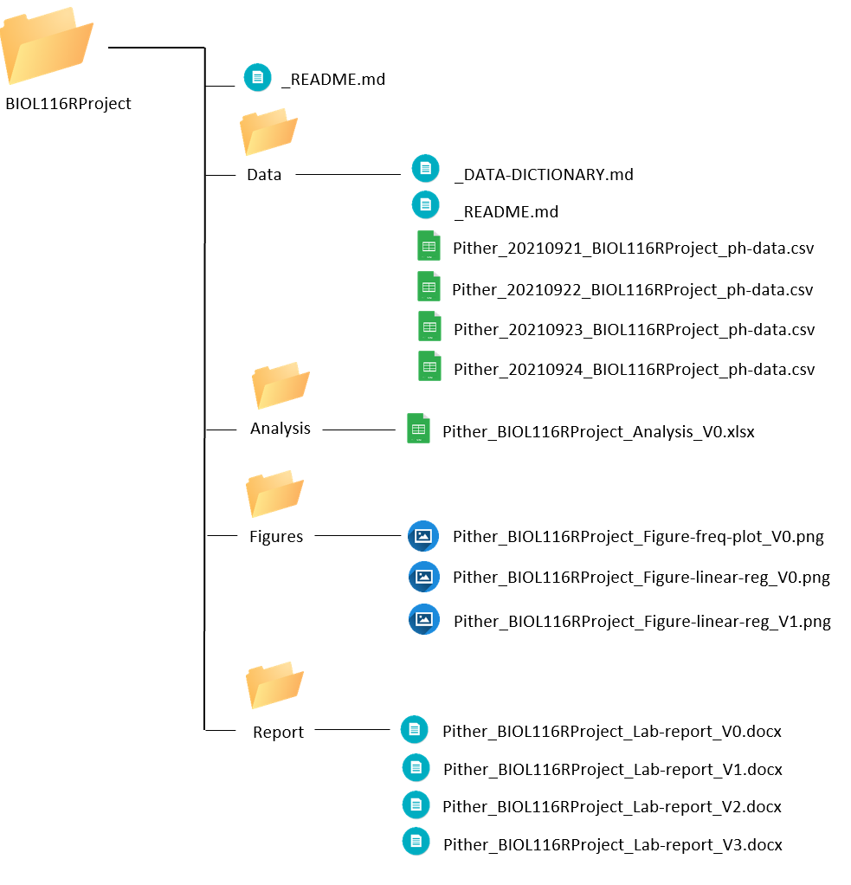
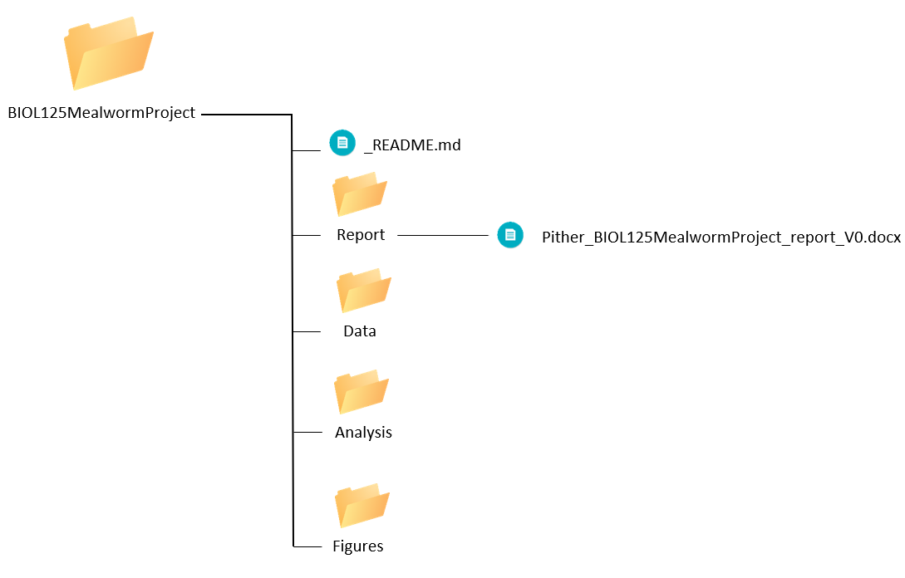
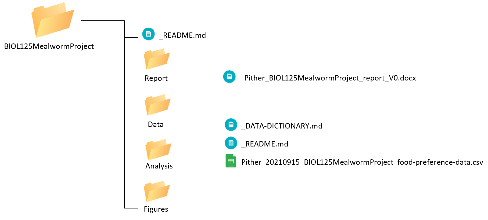
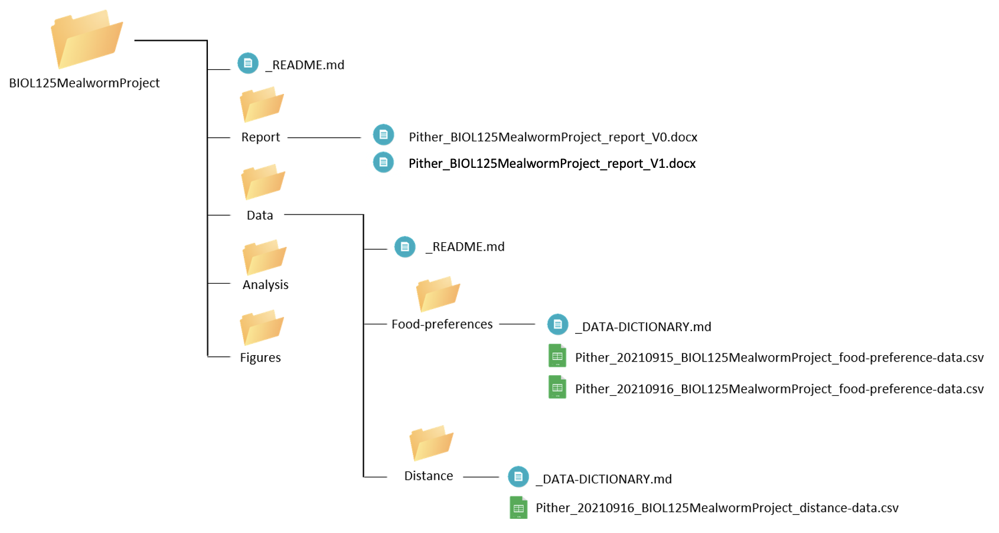
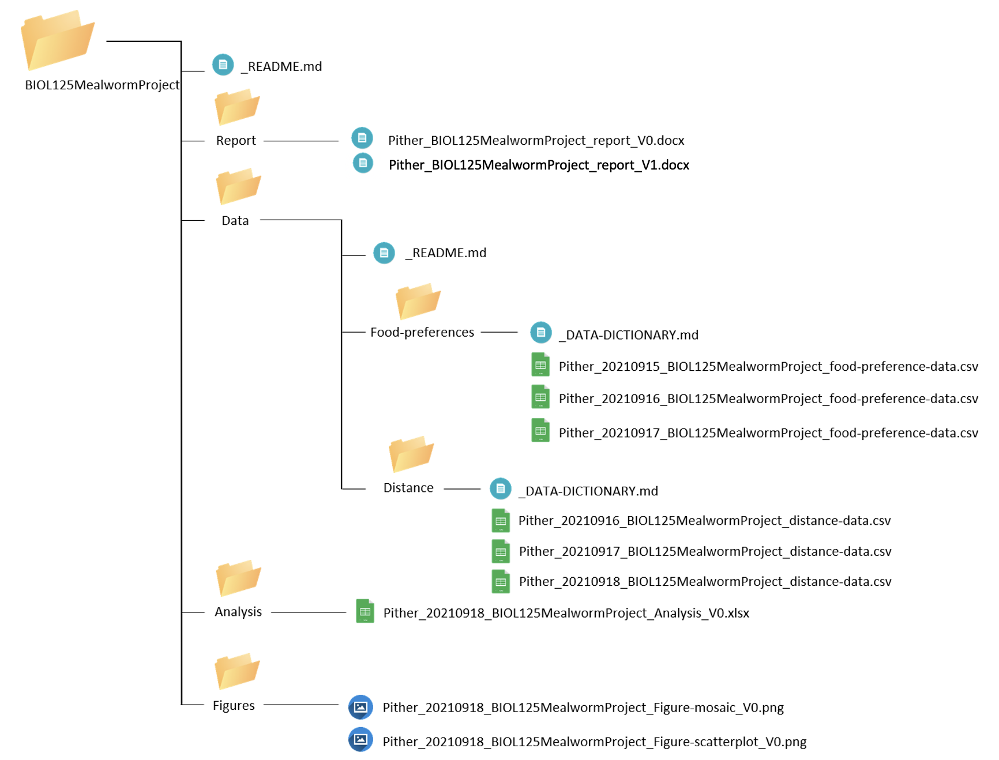
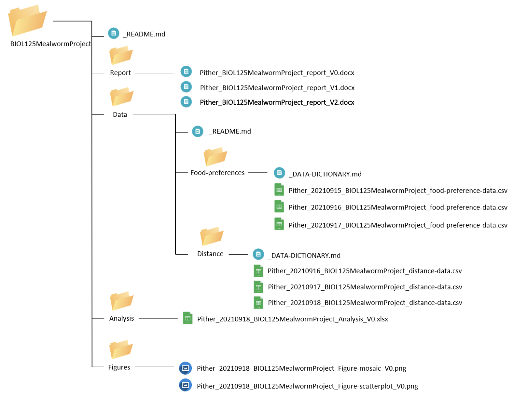

# Directory Structures

Now that we've covered naming conventions, let's pretend that you store everything on your computer in a single folder. Imagine how long it would take you to find data you collected on a specific day a few years ago. Instead of keeping every document in a single place, we often organize our files using directory (aka folder) structures. This helps us save precious time and improve our productivity. 

One major aspect of Open Science is ensuring transparency in the research process. This includes sharing files from all the steps of the research lifecycle (ie. a priori hypothesis, study design, data, analysis etc.) with others so that our research can be understood and replicated more easily. 

The way we currently organize folders and files on our computer may make sense to us, but a problem arises when we need to share those folders and files with other people. A folder name that is meaningful for us may make no sense to another person. So let's cover some conventions to help you organize the files on your computer in a way that is meaningful to both you and others. 

## Directory Hierarchies

First, let's talk about how to properly structure a folder hierarchy. 

The highest ranking folder is generally called the **root directory**, or sometimes the top-level folder. We'll call it the root directory here. This folder will contain all of the subfolders and files related to a particular project, including its data, analysis, lab reports etc. It will also contain what is called a readme file.

The structure should look something like the following:

```
Project-Folder/Experiment-Data/File-1
Project-Folder/Experiment-Data/File-2
Project-Folder/Experiment-Analysis/File-1
Project-Folder/Experiment-Report/File-1
Project-Folder/Experiment-Report/File-2
```

Here, our root folder is called <code>Project-Folder</code> and it contains three subdirectories, one for data, <code>Experiment-Data</code>, one for analyses, <code>Experiment-Analysis</code>, and one for a report <code>Experiment-Report</code>. Each subdirectory then contains one or many files.

## Directory Naming

Key file naming conventions, such as avoiding special characters, are equally as important for directories as they are for naming files. Remember, we consider special characters to be anything other than letters in the English alphabet, numbers from 1-9, dashes \"-\", and underscores \"\_\".

In case there is any doubt, here are some examples of what are considered special characters - characters you want to avoid!

<code># % & < > : \" / \ | ? * { } $ ! \' @ + \` =</code>

**Remember** spaces, \" \", qualify as special characters when it comes to file naming. 

**Remember** when we name the root folder we want to clearly communicate what the project is. And similarly, within this root folder, we want clearly labeled subfolders for each relevant aspect of the project. Common discrete subdirectories include ones for figures, data, manuscript etc. 

## readme files and data dictionaries

When naming files we embed metadata into our file naming conventions to encode relevant information for the reader. But we can only store so much information in a file name. So we also include three additional files

* one called <code>_README</code> that resides in our root folder and elaborates on the contents of our folder structure;
* a second, also called <code>_README</code>, but that resides in our data directory and discusses some of the particulars of the how, where, and who of the actual data collection; and
* one called <code>_DATA-DICTIONARY</code> that also resides in our data directory and elaborates on how our data is stored and organized.

These files - containing a brief description of the major folder contents, naming conventions that were followed, and data structure - are critical for transparency and reproducibility, because they allow others to easily understand the contents of your directory and data without needing to ask you. This is especially helpful when working with a group or sharing directories with others.

### General rules {-}

A readme file and data dictionary should

* exist in at least two locations, the root directory and the data directory.
* be prepended with an underscore \"\_\". This will push these files to the top of the directory for easy access.
* <code>_README</code> and <code>_DATA-DICTIONARY</code> files should be in all caps, so they really stand out; this should be the first thing you look at when looking at any directory or folder, as this is your guide to its contents.

### File formats {-}

readme files and data dictionaries should be written in plain text, this will ensure that the file describing your project and all of its files can be opened on any computer. You will often see readme files called <code>_README.txt</code> or <code>_DATA-DICTIONARY.txt</code>.

Our example readme and data dictionaries use a plain text format called markdown.

#### markdown {-}

We recommend that you create your readme files as markdown, a way of formatting plain text files, allowing us to provide additional meaning to our content. For example, in plain text, if we want to emphasize content, we don't really have a way of doing this. In markdown, we can use italics and bolding if needed. We can also create lists and tables.

Learn the basic syntax of markdown [here]().

## Root folder readme

To create a root folder readme file, use any markdown or text editor (ie. Typora, notepad etc), open a new file and save it to the root folder for your project ensuring the file type is <code>.md</code>.

Name your readme file <code>_README.md</code>.  

Next we want to add some content to our <code>_README.md</code>. The purpose of this document is to describe the directory structure of our project. To adequately describe our directory structure we should include:

* A brief description of the project or purpose of the root folder
* Date when the root folder was created and who created it
* Date when the readme file was last updated and who updated it 
* A brief description of the contents of each major folder within the root folder
* A brief description of file naming conventions used within the directory

To see an example root directory readme file click [here](files/DS_rootREADME.md). 

## Data directory readme

Next, we want to create another readme file but this file will be placed within the subfolder that contains our project\'s data. To do this, open any markdown or text editor (ie. Typora, notepad etc), open a new file and save it to the data subfolder for your project ensuring the file type is .md. Name your readme file <code>_README.md</code>.  

The purpose of this readme file is to provide a description of data collection methods. We will include:

* Date when the data directory was created and who created it
* Date when the readme file was updated and who updated it
* A brief description of each data that was collected, the methods used for collection, and the date range for when each dataset was collected
* A description of who was involved in data collection 
* A brief description of where the data was collected 

To see an example data directory readme file click [here](files/DS_dataREADME.md).

## Data dictionary

Lastly, we need to create a data dictionary which elaborates on how our data is stored and organized. To do this, open any markdown or text editor (ie. Typora, notepad etc), open a new file and save it to the data subfolder for your project. This time we will save the file as <code>_DATA-DICTIONARY.md</code>.

A data dictionary helps others understand the meaning of each element in your datasets within the broader context of the project. Typically you will have an individual readme file for each dataset. This file should include:

* Date when the data dictionary was created and who created it
* Date when the data dictionary file was updated and who updated it
* A description of the raw data file 
* A description of each variable for all datasets including data type, units, number of levels if categorical, and a description of variable levels where relevant
* When describing variables you need to provide the full names and definitions of each variable because often variables are abbreviated in datasets

To see an example data dictionary click [here](files/DS_DATA-DICTIONARY.md). 

## Example BIOL 116

In BIOL 116, we used a flat folder structure to hold all of our files. In the example used, no readme files were created, as we made the assumption that the project was \"simple\" enough in its structure to not warrant a readme file. On reflection, this was an oversight and we probably should have created a readme file describing what was in each file. Neither did we create a data dictionary. We'll do better on future assignments now that we know about the value of both forms of documentation. Anyway, in that example, we ended up with one folder of files that looked like the following before submitting our final assignment:

```
Pither_20210921_BIOL116RProject_ph-data.csv
Pither_20210922_BIOL116RProject_ph-data.csv
Pither_20210923_BIOL116RProject_ph-data.csv
Pither_20210924_BIOL116RProject_ph-data.csv
Pither_BIOL116RProject_Analysis_V0.xlsx
Pither_BIOL116RProject_Figure-freq-plot_V0.png
Pither_BIOL116RProject_Figure-linear-reg_V0.png
Pither_BIOL116RProject_Figure-linear-reg_V1.png
Pither_BIOL116RProject_Lab-report_V0.docx
Pither_BIOL116RProject_Lab-report_V1.docx
Pither_BIOL116RProject_Lab-report_V2.docx
Pither_BIOL116RProject_Lab-report_V3.docx
```

We can see that this might start to get unwieldy if we have a few more files joining the party. So let's break this apart into folders...

### Top Level folder {-}

```
BIOL116RProject/
```

Inside of <code>BIOL116RProject</code> we have one file and four subdirectories:

```
 _README.md
Data/ 
Analysis/
Figures/
Report/
```

Note that we created a <code>_README.md</code> file to describe our directory structure. We'll now distribute our files across these folders...

### Data Folder {-}

Creating a <code>_README.md</code> and a <code>_DATA-DICTIONARY.md</code> to describe our data files and their contents...

```
_DATA-DICTIONARY.md
_README.md
Pither_20210921_BIOL116RProject_ph-data.csv
Pither_20210922_BIOL116RProject_ph-data.csv
Pither_20210923_BIOL116RProject_ph-data.csv
Pither_20210924_BIOL116RProject_ph-data.csv
```

### Analysis Folder {-}

```
Pither_BIOL116RProject_Analysis_V0.xlsx
```

### Figures Folder {-}

```
Pither_BIOL116RProject_Figure-freq-plot_V0.png
Pither_BIOL116RProject_Figure-linear-reg_V0.png
Pither_BIOL116RProject_Figure-linear-reg_V1.png
```

### Report Folder {-}

```
Pither_BIOL116RProject_Lab-report_V0.docx
Pither_BIOL116RProject_Lab-report_V1.docx
Pither_BIOL116RProject_Lab-report_V2.docx
Pither_BIOL116RProject_Lab-report_V3.docx
```

### Screenshot {-}

And finally a screenshot from our desktop file manager...



## Example BIOL 125

Let's work through another example where we start our project off using both appropriate directory structure and file naming conventions. Say you're a student in BIOL 125 working on a research project testing mealworm food preferences...

### Day 1 {-}

On day one of our research project, we are asked to prepare the beginning of a lab report that states our research question, hypothesis, and proposed methods. First, we need to create the root folder for our project:

```
BIOL125MealwormProject/
```

Within our root folder we create a <code>_README.md</code> file to describe our directory structure. Let's add our project name, date the folder was created and who created it, a short description of the project, group member names, file structure (major folders and their proposed content), and naming conventions to this readme file. Your file should look something like this:

[_README.md](files/DS_biol-125-readme_V0.md)

Since we have just started our project, there won't be files in most subfolders we create. However, it's good to have the skeleton of what we want our directory to look like so everyone in the group places new files in the correct location. Later, if needed, we can modify our directory structure and update our readme file to reflect those changes.  

Since we will be using the naming conventions outlined in Chapter 1, we can list those naming conventions here. It may seem strange to outline the naming conventions for documents that haven't been created yet, but having a strategy for naming files from the beginning of the project is very important. It ensures everyone is following the same set of rules when they add or edit files in the project, which helps everyone stay on the same page when working in a shared directory. 

Now that our root folder and root readme files are set up, we need to create the subfolders within <code>BIOL125MealwormProject/</code>. Since we outlined the major subfolders in our readme file as Report, Data, Analysis, and Figures, we'll use these same names when we create the subfolders. Finally, we can open up a new Word document for our lab report and save it to the Report folder using the appropriate naming conventions. 

```
Pither_BIOL125MealwormProject_report_V0.docx
```

Here is what our project directory looks like so far:



### Day 2 {-}

Today, we completed a pilot experiment and collected some data. We saved this data file into our project's corresponding Data folder using appropriate naming conventions. 

New files: 

```
Pither_20210915_BIOL125MealwormProject_food-preference-data.csv
```

Since we have added our first dataset into our project folder, we need to create a corresponding data directory <code>_README.md</code> and <code>_DATA-DICTIONMARY.md</code>.

Let's start by creating the data directory readme and provide a description of our data set, collection methods, who collected the data, and where it was collected. It should look something like this:

[_README.md](files/DS_biol-125-data-readme_V0.md)

Next, let's create a data dictionary for our new dataset. It should look something like this:

[_DATA-DICTIONARY.md](files/DS_biol-125-data-dictionary_V0.md)

Now our project directory looks like this:



### Day 3 {-}

Now that our group has completed its pilot project, we decided to expand our data collection and start recording how far mealworms are willing to travel to get each food. In addition to this new distance data we continued to collect data on food preferences. 

New files:

```
Pither_20210916_BIOL125MealwormProject_food-preference-data.csv
Pither_20210916_BIOL125MealwormProject_distance-data.csv
```

Since we have a new dataset we'll have to update our data directory readme file with a description of the new dataset. Remember to note down the date it was updated and who it was updated by. Our updated data directory <code>_README.md</code> file should look something like this:

[_README.md](files/DS_biol-125-data-readme_V1.md)

Now our updated data directory readme file includes descriptions for both datasets.

In the interest of organization, let's keep our food preferences and distance data in their own subfolders. So, we'll create two new subfolders within the Data folder. We'll call one <code>Food-preferences/</code> and the other <code>Distance/</code>. This way we can organize csv files into the folder for the corresponding dataset. After doing this, we need to update the <code>_README.md</code> in our root folder, since we've modified our directory structure. This readme should now look something like this:

[_README.md](files/DS_biol-125-readme_V1.md)

Next, let's also create a data dictionary for our new dataset within our distance subfolder. Remember to note down the date it was updated and who it was updated by. It should look something like this:

[_DATA-DICTIONARY.md](files/DS_biol-125-data-dictionary-distance_V0.md)

Since we made some updates to our project design and methods, I'll also go ahead and updated our lab report to reflect those changes alongside justification for the changes. Then, I'll be sure to save my updated lab report using the appropriate naming conventions. 

```
Pither_BIOL125MealwormProject_report_V1.docx
```

Now our project directory looks like: 



### Day 4-5 {-}

Over these days, we collected our last rounds of data, created some figures, and analyzed the data. So we have a bunch of new files that we need to make sure are placed correctly within our project directory. 

New files:

```
Pither_20210917_BIOL125MealwormProject_food-preference-data.csv
Pither_20210917_BIOL125MealwormProject_distance-data.csv
Pither_20210918_BIOL125MealwormProject_distance-data.csv
Pither_20210918_BIOL125MealwormProject_Analysis_V0.xlsx
Pither_20210918_BIOL125MealwormProject_Figure-mosaic_V0.png
Pither_20210918_BIOL125MealwormProject_Figure-scatterplot_V0.png
```

We'll save all 3 new data files into the <code>Data/</code> subfolder of our directory. Since we've already described these datasets in the data directory <code>_README.md</code> file and have a corresponding <code>_DATA-DICTIONARY.md</code> for both, there are no more updates needed.

Next, we'll save our analysis into the <code>Analysis/</code> subfolder and the figures into the <code>Figure/</code> subfolder. 

Now our project directory looks like:



### Day 6 {-}

Today is the last day of our project and we completed the final copy of our report. We will make sure this is saved into the Report folder using the appropriate naming conventions. 

New files:

```
Pither_BIOL125MealwormProject_report_V2.docx
```

Our final directory looks like this:



We can start to see that if you were to share your entire project directory with another person it would be relatively easy for them to locate files and understand the meaning behind each document in our project. They would also know when changes were made and who made these changes, so if they had any questions, they'd know exactly who to ask!

