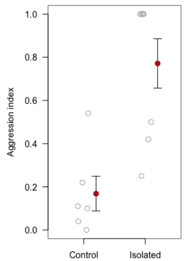
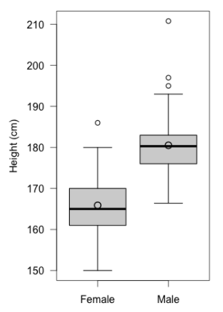
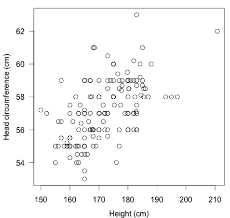

---
output:
  pdf_document: default
  html_document: default
---
# (PART\*) Data Presentation {-}

# Figures & Tables 

These guidelines are based on current \"best practices\" in Biology. You may encounter small differences when working with data or reading the results of research from other disciplines. They aim to achieve consistency among faculty, instructors, and students in how data are summarized and presented within lab reports and research papers.

## Tables

When presenting data in a table keep in mind the following:

* The heading is placed above the table.
* The table should be interpretable as a stand alone object using an informative heading and judicious footnotes
* Sample sizes and units are always included
* Use horizontal lines only; these are often placed above and below headings, and at bottom of table

### Example {-}

The following is an example of a properly formatted table

**Table 1.** Summary of trait measurements made on individuals of *Solidago* ssp. collected within shaded and open habitats in the vicinity of Portland, Oregon.

<table>
  <tr>
    <td rowspan=2>Trait</td>
    <td colspan=2>Habitat: Shaded (<em>n</em> = 20)</td>
    <td colspan=2>Habitat: Open (<em>n</em>+ = 18)</td>
  </tr>
  <tr>
    <td>Mean (sd)</td>
    <td>95% confidence limit</td>
    <td>Mean (sd)</td>
    <td>95% confidence limit</td>
  </tr>
  <tr>
    <td>Leaf area (cm2)</td>
    <td>4.59 (0.974)</td>
    <td>4.14, 5.05</td>
    <td>4.54 (0.972)</td>
    <td>4.24, 5.15</td>
  </tr>
  <tr>
    <td>Leaf mass (mg)</td>
    <td>2.52 (0.765)</td>
    <td>2.15, 2.89</td>
    <td>w.62 (0.705)</td>
    <td>2.25, 2.99</td>
  </tr>
  <tr>
    <td>Root mass (mg)</td>
    <td>9.97 (2.754)</td>
    <td>8.67, 11.26</td>
    <td>9.90 (2.454)</td>
    <td>8.37, 11.16</td>
  </tr>
</table>

\+ data for two individuals misplaced

## Descriptive & Summary Statistics

Here are some general guidelines to follow when displaying descriptive or summary statistics:

* Round numbers to one more digit for measures of centre (e.g. mean), and 2 more digits for measures of spread (e.g. sd) than was used in measuring the data
	* For detailed guidelines about significant digits, consult the following webpage: https://www.physics.uoguelph.ca/significant-digits-tutorial
* Units are preceded by a space within text passages: 
	* e.g. \"Average height was 34.2 cm (± 3.43 SEM).\"

**Describing Numerical Variables**

* Report mean with standard deviation, and additionally median with inter-quartile range for variables that exhibit a non-normal frequency distribution (e.g. is skewed) or that includes outliers
* Parameter estimates (i.e. mean) should be accompanied by measures of uncertainty, i.e. the *standard error of the mean* (SEM) or confidence *interval* (notation: lower limit – upper limit); confidence *limits*: (lower limit, upper limit)
* Confidence intervals are strongly encouraged because they inform about *effect size*
* Measures of uncertainty for an estimate, such as SEM, can be preceded by a ± sign; do not make the common mistake of reporting a ± sign with a standard deviation, as it is not a measure of uncertainty in an estimate

**Describing Categorical Variables**

* Report a frequency table (raw data) or a summary table with proportions for categories (the main descriptive statistic of interest), along with the confidence interval for the proportion if appropriate

## Results of Statistical Tests

Here are some guidelines for reporting the results of statistical tests: 

* Your *Methods* section should clearly state the significance level (α), and this should be decided prior to the study
* Test statistics (e.g. Student’s *t* or an \"F\" from ANOVA) should be rounded to 2 decimal places, and associated *P*-values should report 3 decimal places, or if smaller than 0.001, then <0.001. *P*-values do not indicate effect size, so reporting *P* = 10^-6 is not more impressive than *P* <0.001 
* Concluding statements should, in the absence of a table, include the test, test statistic value, degrees of freedom (*df*) or sample sizes, *P*-value, and confidence interval (if appropriate) in parentheses.
	* For example: \"On average, hair loss was significantly greater among fathers compared to childless men (Welch’s 2-sample *t*-test; *t* = 4.23; *n* F = 18, *n* C = 20; *P* = 0.018; 95% CI for difference: 9.34 – 18.22%).\"  
* Regression and ANOVA results should be shown in a standard ANOVA table format

**Example of ANOVA table format**

**Table 3.**

|           | SS     | df   | MS     | F    | P     |
| --------- | ------ | ---- | ------ | ---- | ----- |
| Treatment | 7.224  | 2    | 3.6122 | 7.29 | 0.004 |
| Error     | 9.415  | 19   | 0.4955 |      |       |
| Total     | 16.640 | 21   | 4.1078 |      |       |

## Figures

When displaying data using a figure, follow these guidelines: 

* The figure heading should be placed below the graph and should provide sufficient information so the figure can be interpreted on its own
* The heading can include statistical statements (Fig. 1) or simply describe what is being shown (Fig. 2)
* Sample size(s) must be reported
* The first time a particular type of graph is shown (e.g. boxplot), details of graph features must be provided. Subsequent figures of the same type can refer to the first for details. See Fig. 2 for an example
* Use hollow symbols so that overlapping points can be seen (Fig. 3)
* Orient all text horizontal (except *y*-axis label), including all tick labels
* Place axis tick marks outside of figure border to avoid overlapping with observations
* Data points should not touch the axes
* Fitted lines (e.g. least-squares regression) included in figures should be fully explained in the heading, 
	* e.g. \“Line represents a least-squares linear regression line, *y* = 0.3 + 4.5*x* (*F* = 5.65, df = 36; P = 0.021)\”. 
* For more complex statistics (e.g. lines associated with mixed effects models) refer the reader to the text for details
* Bar plots should **only** be used to visualize categorical data (e.g. proportion of students with brown or blue eyes) or counts (number of flies on scat)
* When comparing numerical data among categories or groups (Figs. 1,2) use stripcharts (Fig. 1) when sample sizes are small (i.e. <20) and boxplots otherwise (Fig. 2)

### Examples {-}

**Figure 1.** Aggression was significantly higher among isolated ants (*n* = 8) compared to the control group (*n* = 6) (see text for details). Shown are individual observations (grey circles), group means (solid circles) with +/- 1 SEM.

**Figure 2.** Height of male (*n* = 64) and female (*n* = 90) students within BIOL202. Thick horizontal lines represent group medians, large circles represent group means, boxes delimit 1st to 3rd quartiles, whiskers extend to 1.5 x IQR, and small circles represent extreme observations.

**Figure 3**. Head circumference versus height for *n* = 150 BIOL202 students. The positive association is highly significant (Pearson *r* = 0.82; *P* < 0.001). 

