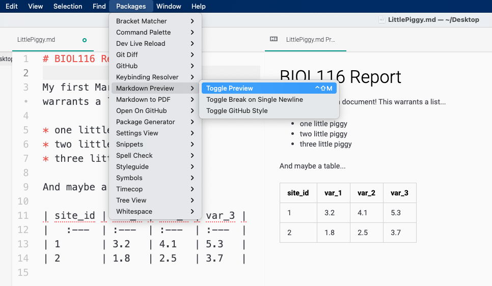

# (PART\*) Writing and Citing {-}

# Markdown 

*Last updated `r Sys.Date()`*

<a href="https://ubco-biology.github.io/Procedures-and-Guidelines/glossary#Markdown">Markdown</a> is a markup language used to format <a href="https://ubco-biology.github.io/Procedures-and-Guidelines/glossary#Plain-text">plain text</a> files to help us provide additional meaning to our content. Markup languages are ideal authoring tools because they work on the principle of separating content from formatting. Markup languages are ideal authoring tools for the sciences because they rely on plain text, so any computer anywhere at any time will be able to open them and consequently, we will be able to read them.

Benefits of Markdown:

* Simple and easy to learn
* Can be used to generate many different output formats (i.e. pdf, html, docx etc.)
* Can be read on any device with any operating system 
* Many different web-applications and websites (e.g. Reddit, GitHub) use markdown 

In fact, when we think about the best practices in science, Markdown is an essential authoring tool because it allows for <a href="https://ubco-biology.github.io/Procedures-and-Guidelines/glossary#Reproducibility">reproducibility</a> and interpretability (i.e. is independent of specific operating systems or programs).

To learn more about Markdown see Matt Cone's Markdown Guide [here](https://www.markdownguide.org/getting-started#:~:text=Why%20Use%20Markdown%3F%201%20Markdown%20can%20be%20used,future%20proof.%20...%205%20Markdown%20is%20everywhere.%20).

## How Markdown Works

Markdown is a two step process. You write, with markup, in a <a href="https://ubco-biology.github.io/Procedures-and-Guidelines/glossary#Plain-text">plain text</a> file. Another application then formats your document based on your markup.


This makes markdown very useful for producing many different types of documents from the same piece of prose, whether that be pdf, html, docx, you name it. It also means that you have one working, editable document, which is plain text, and a series of distributable copies in other formats. More importantly, formatted in a way to address the needs of that particular audience.

All of the content that you\'re reading right now was authored in Markdown. Note at the top of the page, you can download this content as a pdf or as an epub. But we only had to write it once.

## What You Need to Get Started

You\'ll need a text editor or a dedicated <a href="https://ubco-biology.github.io/Procedures-and-Guidelines/glossary#Markdown">Markdown</a> editor! What's the difference?

A text editor will not format your markdown, it\'ll just display the plain text. When you open the <code>_README.md</code> files noted throughout this book (either in **TextEdit** on a Mac or **Notepad** on Windows), you see the raw, plain text output.

<div class = "note">
TextEdit on your mac is not actually a plain text editor; while TextEdit can read and open a Markdown file, it cannot create a Markdown file. MacOS does not ship with a plain text editor like Notepad on Windows. So if you\'re on a Mac, you\'ll need to download a text editor.
</div>

A dedicated Markdown editor will format your Markdown as you type, so you get an idea as to how it will render if you were to save it as a pdf, html etc. There are a lot of Markdown editors available, many of them free and open source, and many for very specific use cases. When you have some free time, you may choose to check out the following comprehensive list [https://www.markdownguide.org/tools/](https://www.markdownguide.org/tools/).

In between a plain text editor and a dedicated Markdown editor are those text editors with add-ons to help you navigate your markup. These options provide a lot of flexibility and finding a text editor of this ilk that you like will be of benefit going forward in your degree. An excellent free and open source, cross platform option is [VS Code](https://code.visualstudio.com/), which has built in support for Markdown rendering.

### Atom {-}

Download Atom at [https://atom.io/](https://atom.io/)

Once downloaded, launch it and you\'ll be presented with an `untitled` blank document. Save it somewhere with a file name of your choosing and a file type of `.md` - so something like, `my-first-note.md`. You can then toggle Markdown preview on and off with your packages menu



<div class = "note">
One other thing that you\'ll want to do is to set up how Atom handles tabs. A tab may be either `hard` or `soft`. A `hard` tab is encoded with a tab character, which can throw off the interoperability that we\'re trying to achieve with using a plain text editor. A `soft` tab is simply encoded as a series of spaces; this plays much better in general as text is moved between programs and operating systems.

So, head into `Settings > Editor > Tab Type` and ensure that it is set to `soft`. At the same time, you should probably turn on `Soft Wrap`.
</div>

## Prose

You can just start writing if you\'ve opened up a new document in MacDown, Markdown Edit, or whatever text or Markdown editor you happen to be using.

However, there's a couple of things you\'ll note right away:

* Whether you use one space, \" \", or many spaces in between your words, it will only render (display with formatting) as if there was one space.
* Just hitting \'Enter\' once doesn't put you on a new line. You need to hit \'Enter\' twice.

## Structure

### Headings  {-}

You can add structure to your text document by adding headers with different hierarchies. To do this, you add a number sign `#` before the text. The number of `#` symbols indicates the hierarchy of the header.

Make sure you include a space \" \" between the `#` and your header

For example, the following...

```
# This is a first-tier header
## This is a second-tier header
### This is a third-tier header
#### This is a fourth-tier header
```

...would render as

<h1>This is a first-tier header</h1>
<h2>This is a second-tier header</h2>
<h3>This is a third-tier header</h3>
<h4>This is a fourth-tier header</h4>

## Emphasis and Style

There are a number of different Markdown syntaxes that we can use to add style and emphasis to specific parts of our document. Below are a few examples.

### Italics {-}

You can make text italicized by encasing the text in a single asterisk `*` or underscore `_`.

Input

```
*This is italicized*

_This is also italicized_
```

Output

*This is italicized*

*This is also italicized*

### Bold {-} 

You can make text bold by encasing the text in two asterisks `**` or underscores 
`__`.

Input

```
**This is bold**

__This is also bold__
```

Output

**This is bold**

**This is also bold**

#### Bold and Italics {-}

If you want to make text both bold and italicized you can encase the text with three asterisks `***` or underscores `___`.

Input

```
***This is bold and italicized***

___This is also bold and italicized___
```

Output

***This is bold and italicized***

***This is also bold and italicized***

**NOTE** When italicizing or bolding characters within a string of text, it\'s better to use an asterisk `*` rather than an underscore `_`. For example: Biology \*is\* awesome NOT Biology \_is\_ awesome

### Strikethrough  {-}

You can strike through text by encasing it with two tildes, `~~`.

Input

```
~~This text has a strike through it~~
```

 Output

~~This text has a strike through it~~

## Code

You can show text as code by encasing it with three backticks, \`\`\`. 

Input

\`\`\`

This text looks like code

\`\`\`

Output

```
This text looks like code
```

## Blockquotes

To create a blockquote using markdown, you need to place a greater-than, `>` sign in front of the text.

Input

```
> This text is placed within a block quote
```

Output

> This text is placed within a block quote

<div class = "note">
Leave a blank line both before the blockquote and after it.
</div>

## Lists

### Ordered lists {-}

To create an ordered list in Markdown, you'll need to place the item number and a period in front of the text.

Input

```
1. First item
2. Second item
3. Third item 
```

Output:

1. First item
2. Second item
3. Third item 

### Unordered lists {-}

You can create an unordered list by placing an asterisk `*`, dash `-`, or plus sign `+` in front of the text.

Input

```
* first item
* second item
* third item 
```

```
- first item
- second item
- third item
```

```
+ first item
+ second item
+ third item 
```

Output

* first item
* second item
* third item 

## Tables

When creating tables using Markdown, pipes `|` separate columns while line breaks are used to separate rows. The column header is separated by three or more hyphens `---` between each column\'s pipe `|`. A colon `:` can be added to the left of the hyphens to left align the column, to the right to right align, and on both ends to centre. The following example is left aligned.

Input

```
| Column 1 Header | Column 2 Header | Column 3 Header |
| :--- | :--- | :--- |
| Column 1 item | Column 2 item | Column 3 item |
| Column 1 item | Column 2 item | Column 3 item |
```

Output

| Column 1 Header | Column 2 Header | Column 3 Header |
| :--- | :--- | :--- |
| Column 1 item | Column 2 item | Column 3 item |
| Column 1 item | Column 2 item | Column 3 item |

**NOTE**

* The number of hyphens, `-`, used can make the cell width look incorrect. However, as long as there are three or more hyphens the rendered output will be the same. 
* Put a space, \" \", between each pipe `|` and the following word or dash `-`

## Links

To create a link to a url or another document, encase the text with square brackets, `[ ]`, and follow the text immediately with the link encased in parentheses, `( )`.

Input

```
To visit the UBC Okanagan Faculty of Biology website click [here](https://biology.ok.ubc.ca/).
```

Output

To visit the UBC Okanagan Faculty of Biology website click [here](https://biology.ok.ubc.ca/).

## Images

Creating a link to an image follows a similar format to that of links, but the square brackets encasing the text are preceded with an exclamation mark `!`. You can place either the url link or path to the image on your computer in the parentheses. If using a path on your computer, use a relative path.

Input

```


```

Output

 on [Unsplash](https://unsplash.com/?utm_source=unsplash&utm_medium=referral&utm_content=creditCopyText)](images/MD_Caterpillar.jpg)

## Markdown Flavours

Everything here is basic, or core, <a href="https://ubco-biology.github.io/Procedures-and-Guidelines/glossary#Markdown">Markdown</a> and will be supported by any markdown editor. Since Markdown is simply encoding document structure through markup, several different implementations have expanded on this core set and allow you to do other things, including footnotes, references etc.

We\'ll keep it simple for the moment; this is all you really need for your <code>_README.md</code> files! Later, you\'ll be introduced to RMarkdown, which, when used in conjunction with R, will allow you to render <a href="https://ubco-biology.github.io/Procedures-and-Guidelines/glossary#Statistical-analysis">statistical analyses</a> within your Markdown document and build reference lists, among other things.
