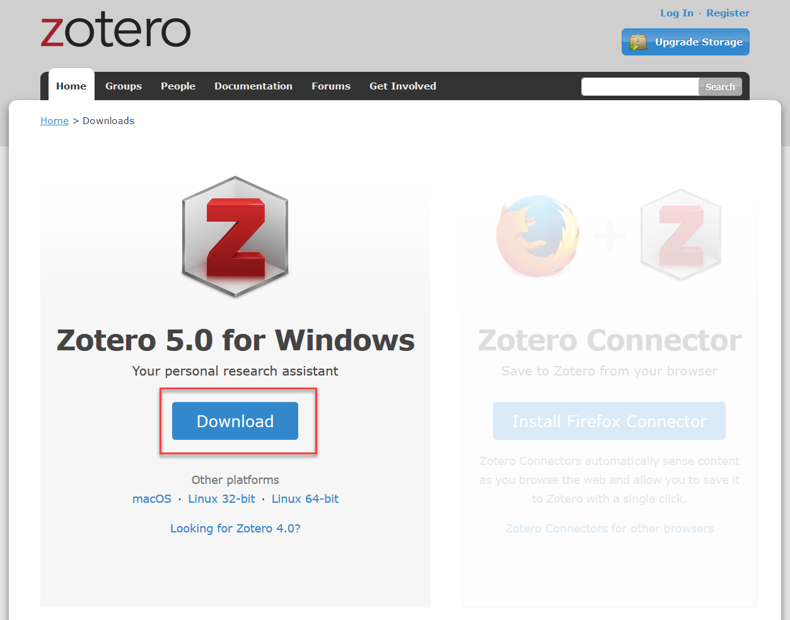
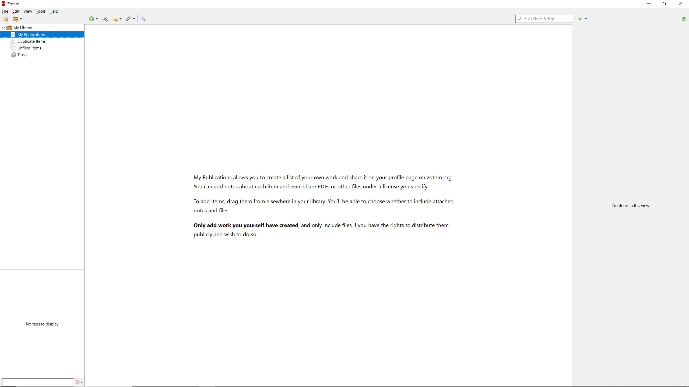
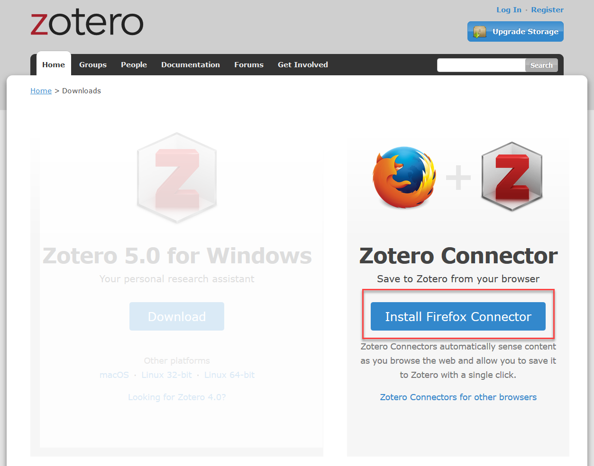
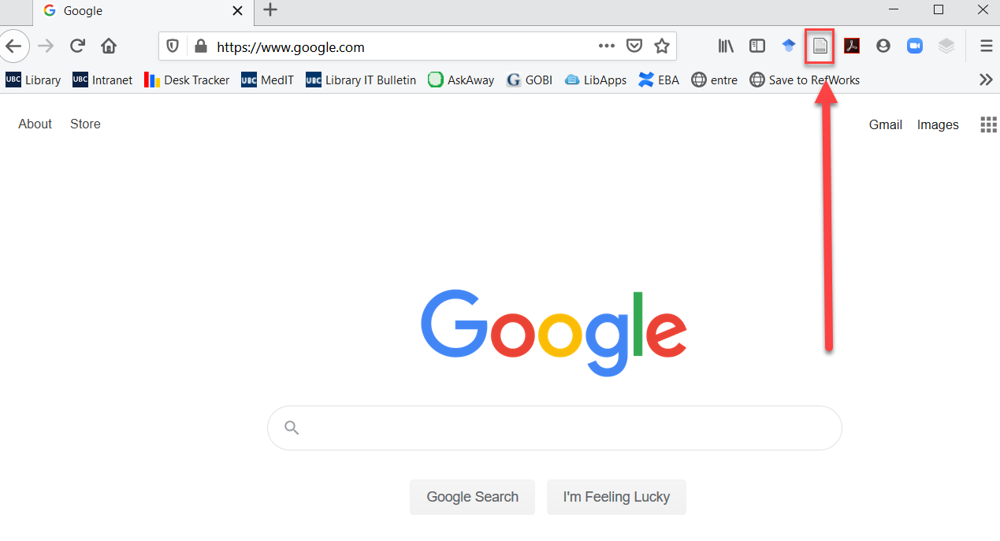
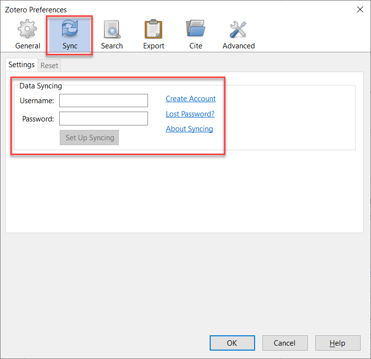
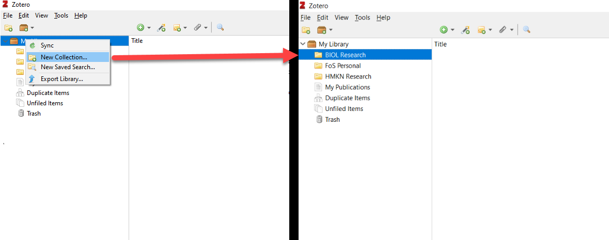
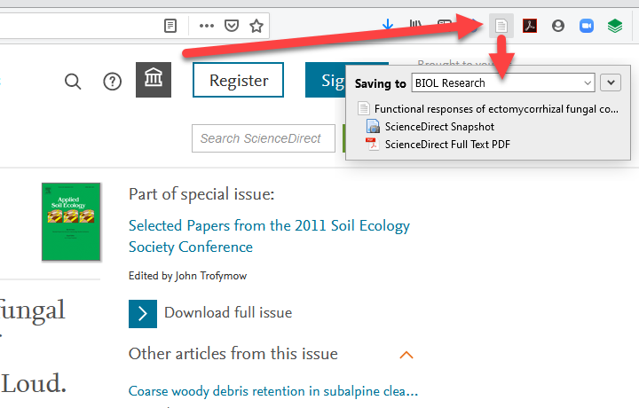
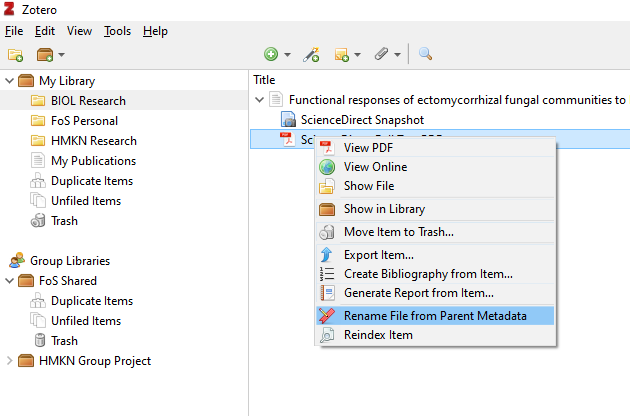

# Reference Management: Zotero

*Last updated `r Sys.Date()`*

Imperative to managing our education and research is managing our readings and references. We can do this manually or we can take advantage of a tool - citation management software - specifically designed to keep your references organized, shareable, and easily citable.

There are several options out there. Some are great for inter-institutional collaborations, some for review projects that have you processing 10s of thousands of citations, and others are great for managing your day to day needs.

Here we\'re going to get you set up with a tool well suited for the latter - Zotero.

This overview will get you set up with an account, and importing your first reference.

Zotero is comprised of 4 components

1. A **desktop application**.
2. A **cloud application** that syncs with your desktop application.
3. A **web browser plugin** that gathers bibliographic information when you're looking at an article online.
4. A **word processor plugin** that facilitates creating citations and reference lists while writing.

## Installation & first launch

First, get your environment set up. **Quite your word processor** and **make sure that you are in a position to quite your web browser**.

Now, the **desktop application and word processor plugin**.

Head to [https://www.zotero.org/download/](https://www.zotero.org/download/){target="_blank"}, download Zotero and Run the installer. 

### First launch {-}

Once installation is complete, if you launch the program, you should be greeted with the following:

That\'s step one and four covered, as the word processor plugin is installed automatically.

The plugin works with Microsoft Office, LibreOffice, and Google Docs. More on this later.

## Browser plugin

At this stage, Zotero will have launched a new window in your web browser, and you should see the opportunity to install the web browser plugin.

If this doesn\'t happen, simply return to [https://www.zotero.org/download/](https://www.zotero.org/download/){target="_blank"} and install the plugin from there.

Zotero will automatically detect your browser. We recommend using either Chrome or Firefox; the plugin for Safari is currently in beta development and a bit more complicated to get configured.

Now, to make sure everything is lined up, quite and then relaunch your web browser. You should then see a small icon in the upper right hand corner. If you\'re in Chrome, you\'ll have a puzzle piece in this same spot, click that and you\'ll see you\'re extensions, including the Zotero extension.

## Accounts & sync setup

An account is required for cloud syncing and sharing folders.

Fill in the necessary credentials here [https://www.zotero.org/user/register/](https://www.zotero.org/user/register/){target="_blank"} and we're almost done.

### Connecting Zotero Desktop with the Cloud {-}

Now that you\'ve created an account, let\'s get your Desktop application connected with you account.

In Zotero, go to `Edit > Preferences` and in the preferences tab go to `Sync`, fill in your credentials and click `Set Up Syncing`.

## Adding citations

First things first - because we want to be organized - in Zotero, create a folder for your project by right clicking on `My Library > New Collections...` and give it a name, like `BIOL Research` because that\'s informative.

Say we\'re searching Web of Science Core Collection, we find an article we\'re interested in and we follow the link to read the article. And let\'s say that takes us here (que to follow the link): [https://www.sciencedirect.com/science/article/pii/S0929139312000224](https://www.sciencedirect.com/science/article/pii/S0929139312000224){target="_blank"}

We\'ll see that when we\'re looking at an article, our web browser plugin changes to reflect this by now looking like a document.

Click on it, and Zotero will harvest both the requisite metadata and the pdf for you.

## Renaming PDFs

Head back into Zotero and you\'ll see your reference.

Select the arrow adjacent to the title and you\'ll see your PDF.

Right click the PDF and select `Rename File from Parent Metadata`. There! You\'ve got a nicely titled article. Double click the PDF and it opens in your default PDF reader.

## Syncing to the cloud

Click the sync button and send your citation and PDF to the cloud.

Sync happens automatically on every launch. And notes or highlights that you make on your PDF will also be synced and updated.

### Zotero Cloud {-}

Head online and log in to your online account at [https://www.zotero.org/user/login/](https://www.zotero.org/user/login/){target="_blank"}

You\'ll see your recently synced citation and associated attachments.